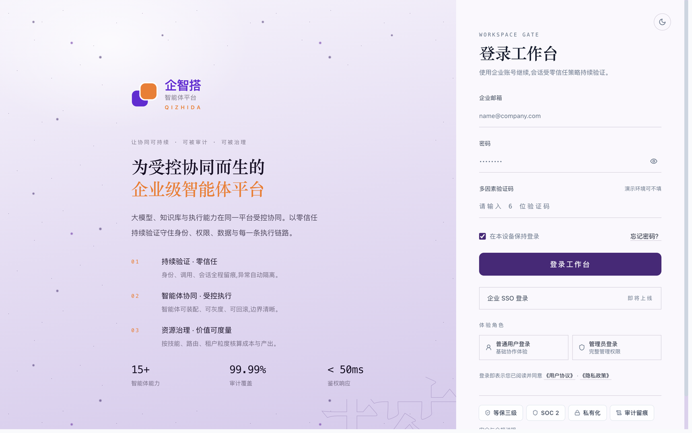
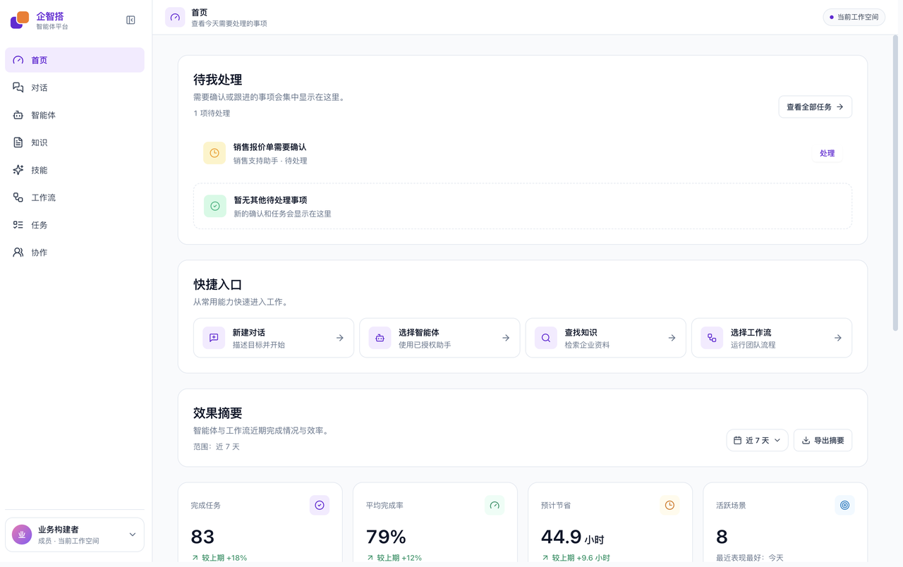
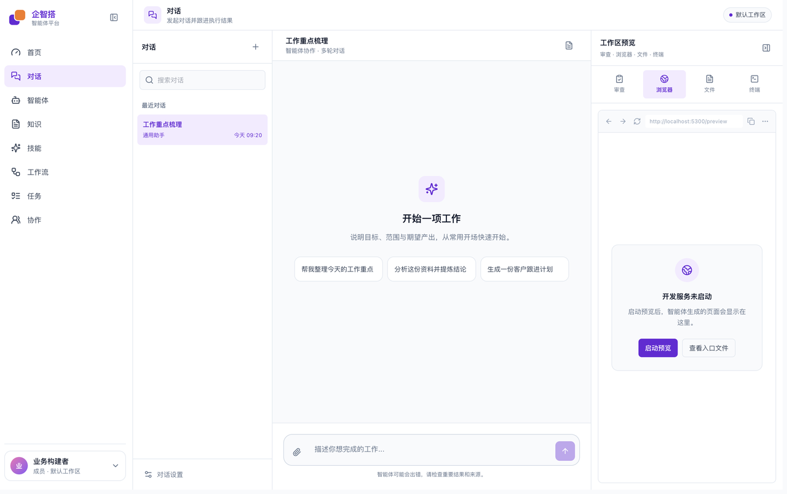
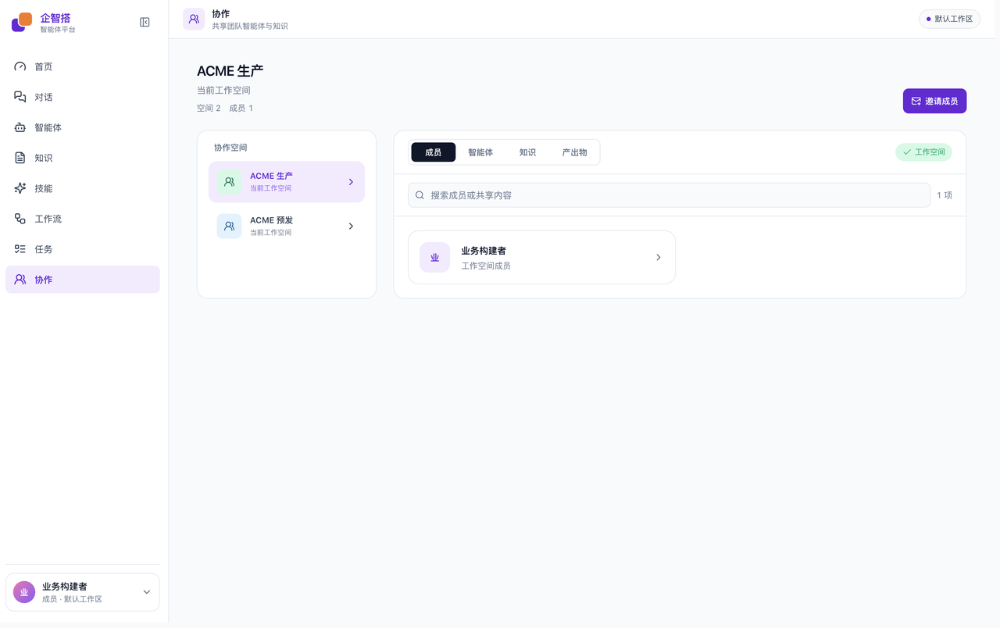
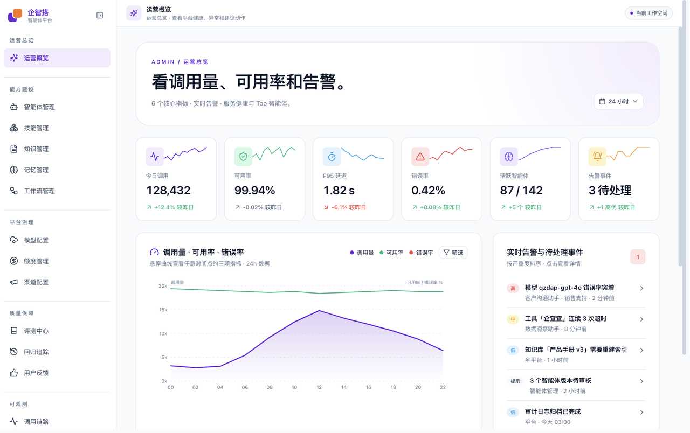
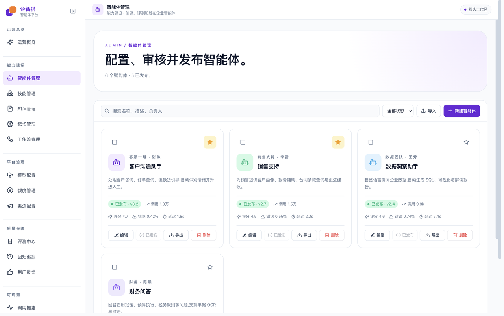
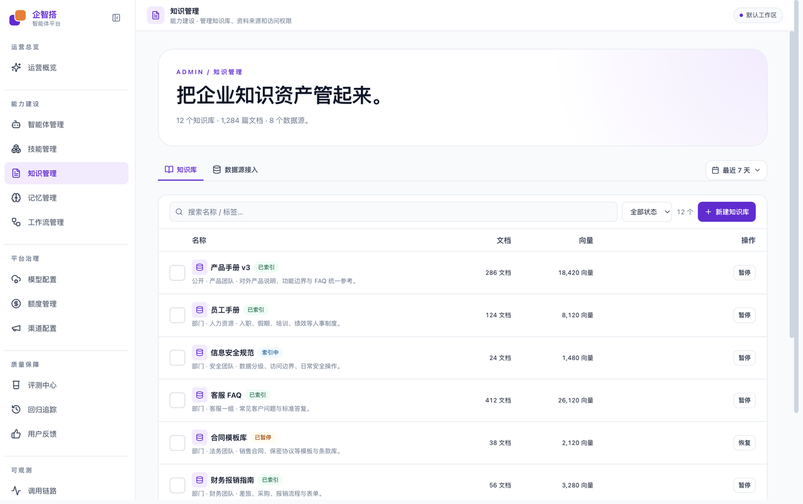
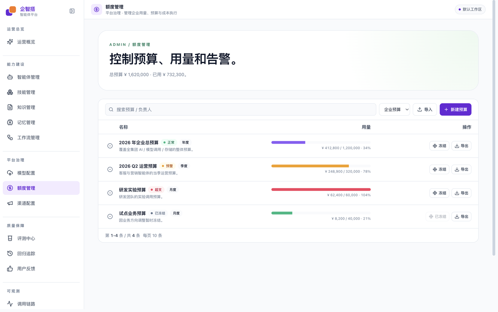
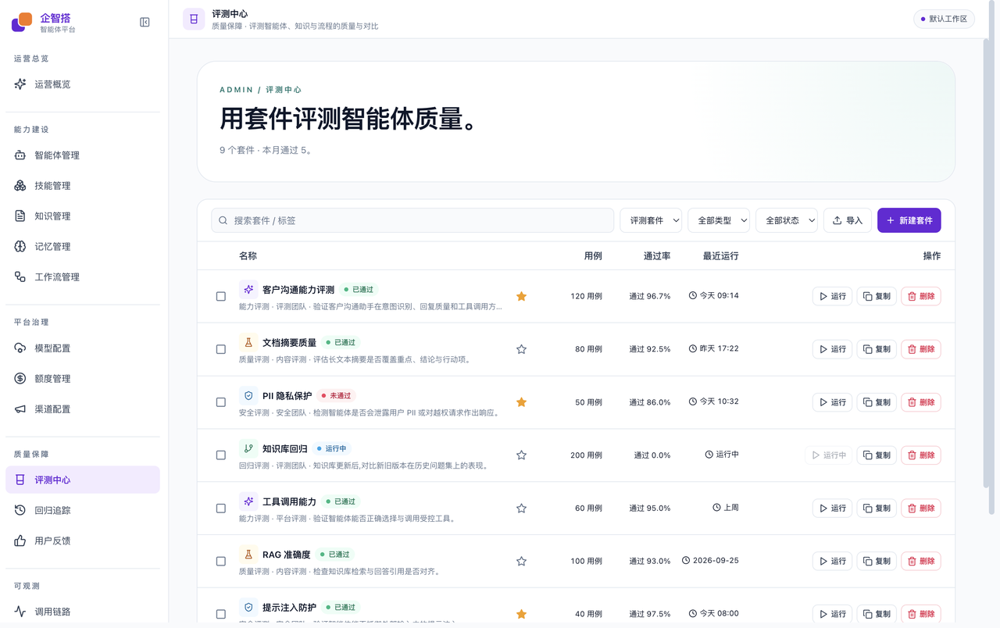
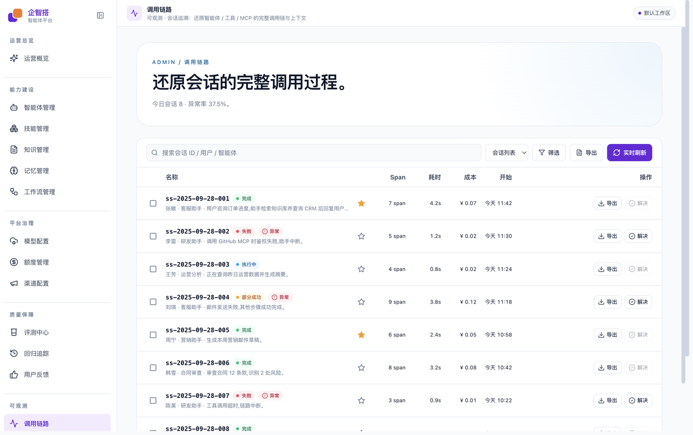

# 企智搭 · 智能体平台

**QiZhiDa · Agent Platform（QZDAP）** 是企业级智能体工作台：管理员建设能力并治理运行，成员从已开放目录选用智能体、知识、技能和工作流去完成工作。

品牌图形是两块圆角方块层叠咬合，白色间隙勾出层次，象征「搭」——像积木一样把企业智能化能力一块一块搭起来。

## 品牌标识

中文名 **企智搭**，英文 **QIZHIDA**，产品线 **智能体平台 / Agent Platform**。技术包名与环境变量用 **QZDAP**（QiZhiDa Agent Platform）。

| 色板 | 色值 | 用途 |
|---|---|---|
| 品牌紫 | `#6828D8` | 后层方块、中文名、工作台主色 `--brand` |
| 强调橙 | `#F87818` | 前层方块、`QIZHIDA`、登录强调 `--brand-accent` |
| 间隙白 | `#FFFFFF` | 两块方块之间的咬合缝 |
| 单色深 | `#1A1A1A` / `#3A3A3A` | 印刷、反白底上的单色组合 |

<p>
  
  &nbsp;&nbsp;
  
  &nbsp;&nbsp;
  
</p>


| 版本 | 构图 | 出现位置 | 文件 |
|---|---|---|---|
| 图标标识 | 紫底圆角方块 + 浅紫/橙叠合方块 | 浏览器 favicon、侧栏收起 | `frontend/web/public/favicon.svg` |
| 横向组合 | 图形在左；右为「企智搭」+ 小字「智能体平台」 | 侧栏展开 | `frontend/web/public/logo-lockup.svg` |
| 登录组合 | 同上，再加一行橙色 `QIZHIDA` | 登录页左侧品牌区 | 由 `BrandLogo` 拼装 |
| 主标识 | 图形 + 企智搭 + QIZHIDA 纵向 | 文档、对外物料 | `frontend/web/public/logo-wordmark.svg` |
| 单色版本 | 深色叠合方块 + 企智搭 + 智能体平台 | 单色印刷 | `frontend/web/public/logo-mono.svg` |

界面实现：`frontend/web/src/components/feedback/BrandLogo.tsx`（`variant`: `mark` / `icon` / `mono`；登录页横向 lockup 带 `caption="QIZHIDA"`）。不要把 Logo 拉变形，间隙必须保留白色、不可填色。

前端是 React 18 + Vite 工作台（用户侧 + 管理侧）；后端是 Python 3.12 + FastAPI 模块化单体。默认联调路径：

```
浏览器 :5200  →  网关 :9200  →  qzdap-app :8200  →  Postgres
```

架构方案见 [`doc/`](./doc/)，决策记录见 [`docs/adr/`](./docs/adr/)。

## 快速开始

推荐用仓库根目录的开发栈（会拉起 qzdap-app、网关和 Vite）。不要占用 Partner 平台 `qzda-app` 的 `:8100`。

```bash
# 依赖：backend 用 uv，frontend 用 pnpm
cd backend && make sync && cp .env.example .env && make db-upgrade
cd ../frontend && pnpm install

# 回到仓库根目录
make qzdap-up          # 启动
make qzdap-status      # 查看端口
make qzdap-down        # 停止
```

工作台：<http://127.0.0.1:5200>  
默认开发账号（种子数据）：

| 角色 | 邮箱 | 密码 | 进入 |
|---|---|---|---|
| 管理员 | `admin@acme.com` | `dev-admin-password-change-me` | `/admin/*` |
| 成员 | `user@acme.com` | `dev-admin-password-change-me` | 工作区路由 |

登录走 `POST /v1/identity/login`，JWT 中的工作区写入 `X-Workspace-Id`。

### 仅前端（演示数据）

不连后端即可浏览界面：

```bash
cd frontend
pnpm --filter web dev:demo
# http://127.0.0.1:5200
```

真实 API 是默认：`pnpm --filter web dev`（`VITE_USE_DEMO=false`，Vite 代理到网关，端口可用 `QZDAP_FRONTEND_PORT` 覆盖）。

```bash
cd frontend/web && pnpm test
```

### 仅后端

```bash
cd backend
make sync
docker compose up -d       # PG (pgvector) + Redis + MinIO
cp .env.example .env
make db-upgrade
make run-app               # 默认 Makefile 端口见 backend/Makefile；联调用 make qzdap-up（:8200）
curl http://127.0.0.1:8200/healthz
```

后端命令须在 `backend/` 下执行。环境变量一律 `QZDAP_*`，Python 包名 `qzdap.*`，前端包名 `@qzdap/web-*`。

## 界面预览

以下截图来自 `pnpm --filter web dev:demo`（前端内存演示数据，无需后端）。

### 登录

管理员与成员从同一登录页进入，角色分流到 `/admin/*` 或工作区。



### 用户侧

成员从已开放目录选用能力，在对话里把工作做完。

| 首页 | 对话 |
|---|---|
|  |  |



### 管理侧

管理员建设目录、治理用量，并用评测与链路看质量。

| 运营概览 | 智能体管理 |
|---|---|
|  |  |

| 知识管理 | 额度管理 |
|---|---|
|  |  |

| 评测中心 | 调用链路 |
|---|---|
|  |  |

## 用户侧

从管理端已发布、并对工作区开放的目录中浏览选用，再进入对话或执行。

| 页面 | 做什么 |
|---|---|
| 首页 | 查看今天需要处理的事项 |
| 对话 | 发起对话并跟进执行结果 |
| 智能体 | 浏览并选用管理员已开放的智能体，进入对话 |
| 知识 | 基于企业资料获取可信答案 |
| 技能 | 选用已发布的 Skill / Tool / MCP |
| 工作流 | 选用团队已发布的工作流 |
| 任务 | 跟进待确认、执行中与已完成事项 |
| 协作 | 共享团队智能体与知识（工作区成员、目录） |
| 设置 | 个人资料、账号安全、通知与偏好 |

## 管理侧

列表默认每页 10 条，点击行进入详情；「新建」进入独立页面。运营类页面走 `/api/admin/*`，目录类走 `/api/catalog/*`。

### 运营总览

| 模块 | 做什么 |
|---|---|
| 运营概览 | 平台健康：调用量、可用率、告警、服务状态与热门智能体 |

### 能力建设

| 模块 | 做什么 |
|---|---|
| 智能体管理 | 创建、配置、审核并发布企业智能体 |
| 技能管理 | 维护 Skill / Tool / MCP 等可调用能力 |
| 知识管理 | 管理知识库、资料来源和访问权限 |
| 记忆管理 | 管理短期会话、长期事实与知识层记忆 |
| 工作流管理 | 编排、发布可执行工作流 |

用户侧的智能体、知识、技能、工作流分别来自以上目录，仅已发布并对工作区开放的条目可被选用。

### 平台治理

| 模块 | 做什么 |
|---|---|
| 模型配置 | 接入供应商（名称、API Key、地址、协议），拉取模型列表并配置路由 |
| 额度管理 | 预算、部门用量、告警阈值 |
| 渠道配置 | 飞书、企微、钉钉与 Web 对话入口，以及通知组 / Webhook |

### 质量保障

| 模块 | 做什么 |
|---|---|
| 评测中心 | 用套件评测智能体、知识与流程质量 |
| 回归追踪 | 对比基线，发现版本退化 |
| 用户反馈 | 收集赞踩与工单，按规则分诊处理 |

### 可观测与设置

| 模块 | 做什么 |
|---|---|
| 调用链路 | 还原会话中智能体 / 工具 / MCP 的完整调用过程 |
| 工具审计 | 审查工具调用、权限越界与风险规则 |
| 运行指标 | 观测可用率、延迟、Token 与成本 |
| 平台设置 | 品牌、合规开关和成员 |

## 仓库结构

```
.
├── backend/         Python 3.12 + FastAPI + uv workspace（qzdap.*）
├── frontend/        pnpm workspace
│   ├── web/         工作台 SPA（含 public/ 品牌 SVG）
│   └── packages/    @qzdap/web-api、ui、hooks、types、utils
├── bin/qzdap-stack/ 本机开发栈（Vite + 网关 + qzdap-app）
├── deploy/          部署脚本与编排
├── infra/           k8s / envoy / prometheus / grafana
├── doc/             架构设计（backend + web）
├── docs/            ADR、runbook 与演示截图（images/demo）
└── README.md
```

## 工程约定

- Conventional Commits（commitlint）
- 后端 pre-commit：ruff、mypy（strict）、lint-imports、gitleaks
- 多租户请求携带 `X-Tenant-Id` 与 `X-Workspace-Id`
- 演示模式 `VITE_USE_DEMO=true` 只注入本地 mock，生产构建不触达
